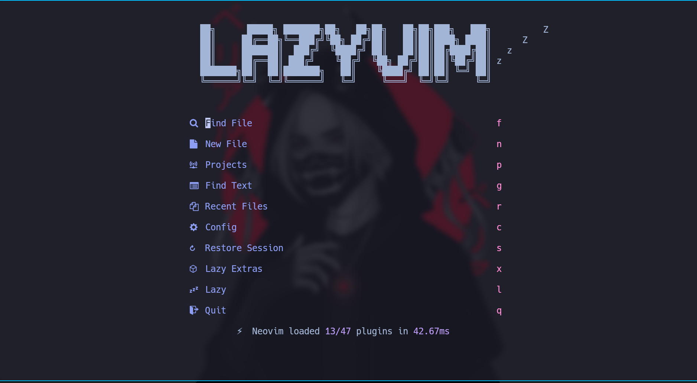
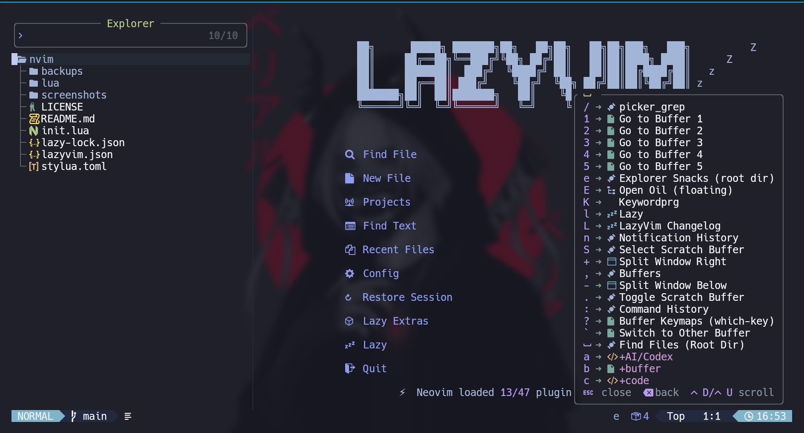

# 💤 LazyVim

A starter template for [LazyVim](https://github.com/LazyVim/LazyVim).
Refer to the [documentation](https://lazyvim.github.io/installation) to get started.

## Screenshots

<!-- Add your screenshots below -->

<!--  -->
<!--  -->

## Plugins

- [lazyvim](https://www.lazyvim.org/) - Neovim config framework
- [blink.cmp](https://github.com/saghen/blink.cmp) - Completion plugin
- [Oil](https://github.com/stevearc/oil.nvim) - File explorer
- [fzf-lua](https://github.com/ibhagwan/fzf-lua) - Fuzzy finder
- [Flake8](https://pypi.org/project/flake8/) - Python linter (required)
- [stylua](https://github.com/astral-sh/ stylua) - Lua formatter (required)
